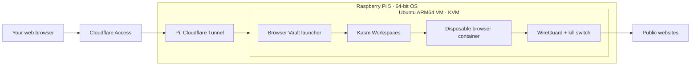

# Browser Vault

**A private browser VM, hosted on your Raspberry Pi.**

Browser Vault gives you an interactive remote browser through a web page. Pick Chromium, Firefox or Brave, choose its CPU and memory limit, and open a fresh session. The Pi does the work; your laptop can be turned off when you are finished.

The browsers run inside a dedicated Ubuntu virtual machine accelerated by KVM. Each session gets a disposable container inside that VM. Ending a session removes its container and temporary profile; the VM stays running for the next session.

[Installation](docs/INSTALL.md) · [Architecture](docs/ARCHITECTURE.md) · [Operations](docs/OPERATIONS.md) · [Security](SECURITY.md)

## What you get

- A full browser display with keyboard and mouse input, opened in its own tab.
- Chromium, Firefox and Brave on ARM64.
- Three resource profiles, plus 5-, 15- or 30-minute session limits.
- Smooth and Sharper display modes, automatic opening and reconnect controls.
- Cloudflare Access sign-in for the launcher and browser display.
- Browser-only WireGuard routing with a persistent kill switch.
- Separate network restrictions inside the VM and on the Pi host.
- Live protection checks that block new sessions when checks fail or become stale.

| Profile | CPU limit | Memory limit |
| --- | ---: | ---: |
| Light | 1 vCPU | 2 GiB |
| Balanced | 2 vCPU | 3 GiB |
| Power | 3 vCPU | 4 GiB |

One browser session runs at a time. Clipboard sharing, file transfer, shared folders, persistent profiles, webcam and microphone forwarding are disabled by the supplied configuration.

## How it fits together



The VM is an extra isolation boundary between the browser service and your Pi. It is persistent, rather than recreated for each visit. Browser Vault is purpose-built for remote browsing; it does not expose a general desktop or VM administration console.

## Hardware and services

The reference installation uses a Raspberry Pi 5 with 8 GB RAM and a 128 GB microSD card, 64-bit Raspberry Pi OS Bookworm, and an Ubuntu 24.04 ARM64 guest. The VM is allocated four vCPUs, 6.5 GiB RAM and a sparse 90 GiB disk. Leave the remaining host memory available; avoid running other memory-heavy services alongside it.

You also need a domain managed through Cloudflare, Cloudflare Tunnel and Access, a WireGuard VPN configuration with a public IPv4 endpoint, and Kasm Workspaces 1.19.0. Kasm is downloaded separately and has its own license. The setup has been used with Proton VPN; the configuration parser accepts only a limited WireGuard format.

Start with the [installation guide](docs/INSTALL.md). This is an administrator-oriented setup, with explicit stages and verification steps. It is not a one-command installer or a prebuilt disk image.

## Development

Use Node.js 24 and Python 3.10 or newer.

```sh
npm ci
npm --prefix selfhost ci --ignore-scripts
npm test
npm run build
python3 -m unittest discover -s tests -v
node scripts/package.mjs
```

`npm run dev` serves the interface on localhost. It does not start a VM or fake a connected server. Build output goes to `selfhost-dist/`; installation bundles go to `dist/`.

The real-broker integration test, `tests/broker_integration.py`, uses a local HTTPS Kasm stub. Run it as root in a disposable Linux development environment after building and packaging; root ownership is required for the health-report checks. CI runs this test without a Pi or live credentials.

| Directory | Contents |
| --- | --- |
| `app/`, `components/` | Launcher interface |
| `selfhost/` | Authenticated session broker and policy checks |
| `pi-admin/` | VM, guest, firewall, VPN and verification scripts |
| `config/` | Configuration examples without credentials |
| `docs/` | Setup, architecture and maintenance |

## Status and limits

This is the first public source release of an existing Pi deployment. Automated checks cover authentication, API handling, protection-state decisions, configuration validation and the frontend build. The generalized installation procedure still needs a clean-device installation test. Hardware checks are provided separately and are not implied by a passing CI run.

Browser Vault reduces exposure through layered isolation. It does not make a website trustworthy, guarantee protection against VM escapes, or provide an air gap. Do not use it as a substitute for a dedicated malware-analysis lab. Read the [security model](SECURITY.md) before exposing an installation.

## License

Browser Vault's original code is available under the [MIT License](LICENSE). Retained template, font and stylesheet notices are listed in [Third-party notices](THIRD_PARTY_NOTICES.md). Kasm, browser images, operating systems and hosted services retain their own licenses and terms.
